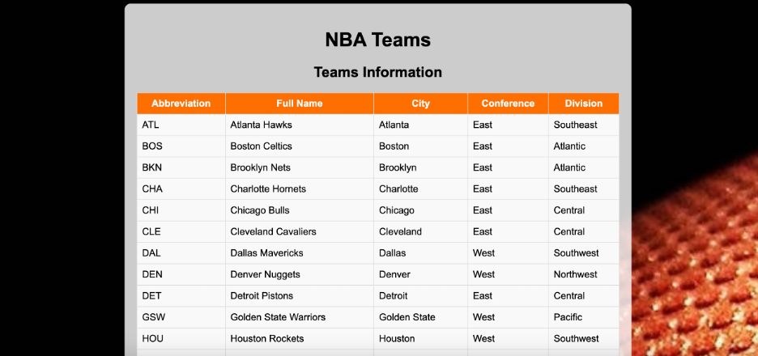
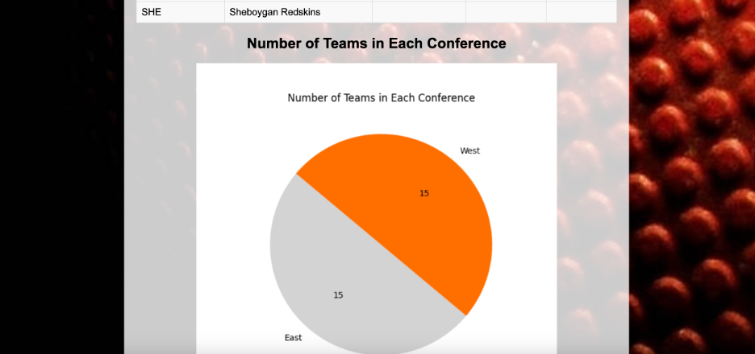
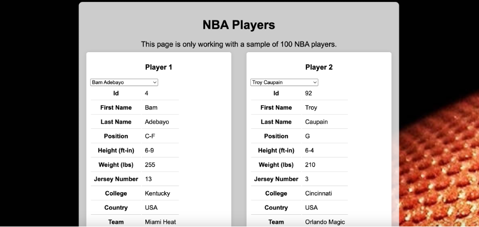
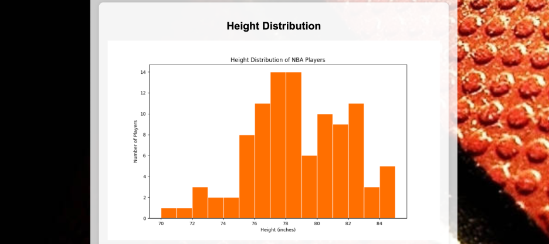
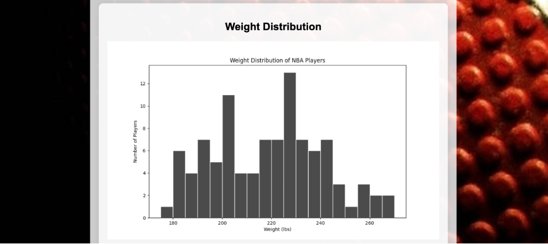
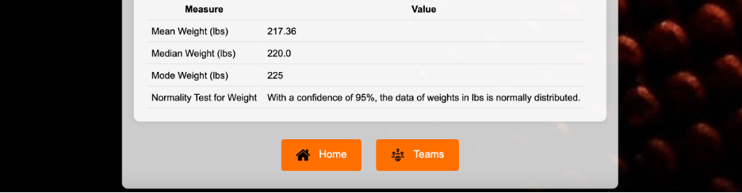

# 
 NBA Information Web Application 

## Introduction & Context

Welcome to the NBA Information Web Application! This project provides an interactive platform where users can explore details about NBA teams and players. Users can view player information, compare two players, and analyze height and weight distributions through various visualizations. The application is designed to offer an engaging experience for basketball enthusiasts and data analysts alike.

## Flow of the Data Architecture

The data for this application is sourced from a series of APIs that provide detailed information about NBA players and teams. The flow of data is as follows:

1. **Data Retrieval**: The application fetches player data through API endpoints. These endpoints return JSON objects containing player attributes such as height, weight, and team information.
2. **Data Integration**: The retrieved data is then parsed and integrated into the webpage. JavaScript functions handle dynamic data fetching and updating the HTML content based on user selections.
3. **Comparison & Analysis**: Users can select two players to compare their attributes. The application calculates and displays differences in height and weight. Additionally, statistical distributions for player heights and weights are visualized using histograms.

[Check this project on Replit](https://replit.com/@grisales1803/Assignment9ConnectedData)

## Conclusions

This web application provides a comprehensive view of NBA player statistics and comparisons. The dynamic features enhance user interaction, allowing for detailed analysis and comparison of player attributes. The use of visualizations like histograms aids in understanding the distribution of key metrics such as height and weight. Overall, this project showcases how web technologies can be leveraged to create engaging and informative sports data applications.

## Screenshot of the Webpage

### Home

### Teams

### Players

